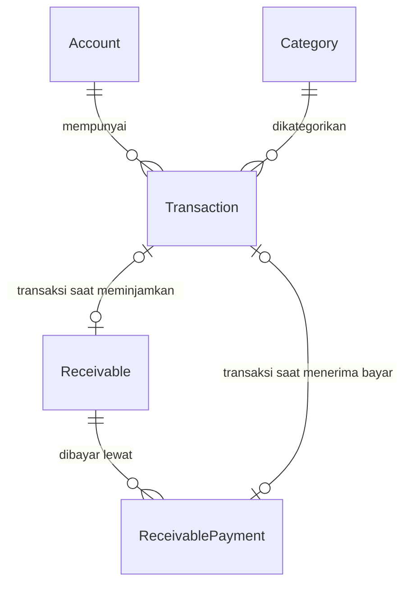

# Keuangan Pribadi

Pencatat keuangan pribadi berbasis web. Mencatat pemasukan dan pengeluaran,
mengelola akun dan kategori, lalu melihat ringkasan bulanan beserta rincian
per kategori.

Dibangun dengan Next.js 15 (App Router), TypeScript, Prisma, SQLite, dan
Tailwind CSS v4. Berjalan lokal di satu mesin, tanpa login, tanpa layanan
eksternal. Seluruh data tersimpan di file `prisma/dev.db`.

## Prasyarat

- Node.js 20 atau lebih baru (diuji di Node 22)
- npm 10 atau lebih baru

## Menjalankan

```bash
npm install          # sekaligus menjalankan `prisma generate`
npm run db:migrate   # membuat tabel di prisma/dev.db
npm run db:seed      # mengisi kategori bawaan + akun "Dompet Tunai"
npm run dev          # http://localhost:3000
```

## Perintah npm

| Perintah | Kegunaan |
| --- | --- |
| `npm run dev` | Server pengembangan di `http://localhost:3000` (hanya localhost) |
| `npm run build` | Build produksi |
| `npm start` | Menjalankan hasil build produksi |
| `npm run lint` | ESLint |
| `npm test` | Menjalankan seluruh tes (Vitest) |
| `npm run test:watch` | Mode watch selama pengembangan |
| `npm run db:migrate` | Membuat dan menerapkan migrasi (`prisma migrate dev`) |
| `npm run db:push` | Mendorong skema langsung tanpa berkas migrasi |
| `npm run db:seed` | Menjalankan `prisma/seed.ts` (aman diulang) |
| `npm run db:reset` | Menghapus database, menerapkan migrasi, lalu seed |
| `npm run db:backup` | Menyalin database ke `prisma/backups/` (aman saat server hidup) |
| `npm run db:studio` | Prisma Studio untuk melihat dan mengubah data |

Server pengembangan dan produksi sengaja hanya mendengarkan di `127.0.0.1`.
Aplikasi ini tidak punya autentikasi, jadi membukanya ke jaringan LAN berarti
siapa pun bisa menghapus seluruh data keuangan.

## Model data

Lima model: `Account`, `Category`, `Transaction`, `Receivable`,
`ReceivablePayment`.



Foreign key memakai `onDelete: Restrict`, jadi akun atau kategori yang masih
dipakai transaksi tidak bisa dihapus. Hapus memang diblokir; arsipkan
sebagai gantinya agar riwayat tetap utuh.

## Total kekayaan

Angka utama di paling atas dashboard:

```
Total kekayaan = cash di seluruh akun + piutang yang belum lunas
```

Tidak ada tabel database tambahan untuk ini. Nilainya dirakit di
[`src/server/queries/wealth.ts`](src/server/queries/wealth.ts) dari
[`getAccountBalances()`](src/server/queries/finance.ts) dan
`getReceivableSummary()`. Rumus yang murni ada di
[`src/lib/wealth.ts`](src/lib/wealth.ts) supaya bisa diuji terpisah dari
pembacaan database.

**Akun terarsip tetap dihitung.** Arsip hanya berarti akun disembunyikan dari
pilihan form, bukan berarti uangnya hilang. Mengabaikannya akan membuat total
kekayaan kurang dari kenyataan, dan itu berbahaya untuk satu-satunya angka
yang dipakai mengukur progres tabungan. Karena itu `getAccountBalances()`
menerima opsi `includeArchived`, dan total kekayaan selalu meminta `true`.

Agar angkanya bisa diaudit, daftar "Saldo akun" di dashboard juga menampilkan
akun terarsip dengan badge "Diarsipkan", diwarnai lebih redup. Kalau total
menyebut angka tertentu, kamu bisa cari akun mana saja yang menyusunnya.

**Pengeluaran riil.** Meminjamkan uang ke orang lain tercatat sebagai
pengeluaran, padahal itu bukan pengeluaran, hanya berubah bentuk uang. Karena
itu kartu Pengeluaran menampilkan nominal setelah dikurangi bagian piutang, dan
ada catatan pengurang di bawahnya kalau ada piutang aktif di bulan itu.

## Piutang

Fitur untuk mencatat uang yang dipinjamkan ke orang lain.

**Cara hitungnya.** Saat kamu mencatat piutang, sistem otomatis membuat satu
transaksi **EXPENSE** sebesar nominal di akun yang dipilih, karena uangnya
benar-benar keluar. Saat pembayaran diterima, tercatat sebagai transaksi
**INCOME** di akun tujuan. Dua-duanya terhubung ke catatannya lewat relasi.

Konsekuensinya: saldo kas kamu selalu akurat, dan sisa piutang bisa
dihitung ulang dari transaksi yang sama. `remaining` sengaja tidak disimpan
sebagai kolom, melainkan selalu dihitung dari `amount` dikurangi jumlah
pembayaran, sehingga tidak ada angka yang bisa melenceng dari pembayarannya.

**Antarmuka.** Halaman `/piutang` menampilkan total outstanding, yang lewat
jatuh tempo, dan yang jatuh tempo dalam 30 hari ke depan. Tiap baris punya
progress bar pembayaran dan label status: Terlambat, Belum lunas, Lunas, atau
Dibatalkan. Halaman detail `/piutang/[id]` memuat form pembayaran, riwayat
pembayaran, dan formulir ubah.

**Yang dijaga server.** Aturan berikut ditegakkan di Server Action, bukan
hanya di antarmuka:

| Aturan | Kenapa |
| --- | --- |
| Pembayaran tidak boleh melebihi sisa | Sisa tidak boleh jadi negatif |
| Nominal pokok tidak boleh turun di bawah total yang sudah dibayar | Menghindari sisa negatif saat diubah |
| Tanggal bayar tidak boleh sebelum tanggal pinjam | Mencegah tanggal masuk yang tidak masuk akal |
| Jatuh tempo tidak boleh sebelum tanggal pinjam | Sama |
| Piutang lunas atau dibatalkan tidak menerima pembayaran | Mencegah pemasukan pada piutang mati |
| Piutang yang sudah punya pembayaran tidak bisa dihapus | Melindungi riwayat rekonsiliasi |
| Kategori harus sesuai jenis (EXPENSE saat meminjam, INCOME saat menerima) | Mencegah pembukuan terbalik |

Aturan numeriknya dipisah ke
[`src/lib/receivable-rules.ts`](src/lib/receivable-rules.ts) supaya bisa diuji
tanpa menjalankan Server Action.

## Tiga keputusan yang perlu diketahui

### 1. Nilai enum disimpan sebagai `String`

Prisma **tidak** mendukung `enum` pada SQLite. Field `Account.type`,
`Category.kind`, dan `Transaction.kind` karena itu disimpan sebagai teks.
Validasi berlangsung dua lapis: union type di `src/lib/types.ts` dan zod di
`src/lib/validations/`.

### 2. Tanggal disimpan sebagai UTC midnight

`Transaction.occurredAt` menyimpan UTC midnight dari tanggal lokal
Asia/Jakarta. Input `2026-10-01` menjadi `2026-10-01T00:00:00.000Z`.

Semua agregasi bulanan melewati `monthToRange()` di `src/lib/date.ts` yang
menghasilkan rentang `[awal, akhir)` dalam batas UTC. Karena SQLite
menyimpan `DATETIME` sebagai teks dan membandingkannya secara leksikografis,
normalisasi ke UTC membuat batas bulan selalu konsisten. Tanpa ini transaksi
dapat meleset ke bulan tetangga.

### 3. Nominal memakai `Int`, bukan `BigInt`

`amount` disimpan sebagai rupiah penuh tanpa sen dan **selalu positif**; arah
uang ditentukan oleh `kind`. Batas `Int` 32-bit adalah
`Rp 2.147.483.647` per transaksi.

`BigInt` sengaja dihindari karena nilainya tidak bisa di-`JSON.stringify`,
sehingga memicu error "Props must be serializable" saat melewati batas
Server Component ke Client Component.

## Tampilan

Antarmuka mendukung mode terang dan gelap. Pilihan tema disimpan di
`localStorage`, dan dibaca ulang oleh skrip inline di
[`src/app/layout.tsx`](src/app/layout.tsx) sebelum halaman digambar sehingga
tidak ada kedipan putih saat reload.

### Token warna semantik

Komponen memakai nama warna peran, bukan warna mentah:

| Token | Kegunaan |
| --- | --- |
| `bg-surface`, `bg-surface-muted` | Permukaan kartu dan area cekap |
| `text-foreground`, `text-muted-foreground` | Teks utama dan sekunder |
| `border-border` | Garis pemisah |
| `bg-primary`, `text-primary-foreground` | Aksi utama dan navigasi aktif |
| `text-income`, `text-expense` | Warna pemasukan dan pengeluaran |

Nilai token ini didefinisikan sebagai variabel CSS di
[`src/app/globals.css`](src/app/globals.css) pada blok `:root` dan `.dark`.
Artinya mode gelap cukup dari satu blok token, tanpa menuliskan varian `dark:`
di setiap komponen.

### Ikon

Ikon garis disimpan sebagai komponen React di
[`src/components/Icons.tsx`](src/components/Icons.tsx), bukan paket ikon
eksternal, supaya tidak ada request jaringan tambahan.

### Struktur direktori

```text
src/
├── app/
│   ├── page.tsx                  # Dashboard
│   ├── akun/                     # CRUD akun
│   ├── kategori/                 # CRUD kategori
│   ├── piutang/                  # daftar, baru, dan detail
│   └── transaksi/                # daftar, baru, dan ubah
├── components/
│   ├── Icons.tsx                 # set ikon garis
│   ├── ThemeToggle.tsx           # pengalih terang/gelap
│   ├── WealthCard.tsx            # kartu total kekayaan
│   ├── layout/                   # AppShell, SidebarNav, NavLinks, MobileNav
│   ├── ui/                       # primitif: Card, Button, Form, dialog
│   ├── accounts/ categories/ transactions/ receivables/
├── lib/
│   ├── db.ts                     # Prisma singleton
│   ├── money.ts                  # format & parse rupiah
│   ├── date.ts                   # bulan, UTC midnight, rentang
│   ├── types.ts                  # konstanta & union type domain
│   ├── receivable-rules.ts       # aturan bisnis piutang (murni)
│   ├── wealth.ts                 # rumus total kekayaan (murni)
│   └── validations/              # skema zod
└── server/
    ├── actions/                  # mutasi ('use server')
    └── queries/                  # agregasi baca: finance, receivables, wealth
```

## Pola mutasi

Semua tulisan lewat Server Action dengan urutan yang sama:

1. `zod.safeParse` isian `FormData`
2. cek integritas di database (akun aktif, kategori cocok jenis)
3. tulis, lalu `revalidateFinancePages()` untuk invalidate keempat path
4. `redirect()` ke daftar setelah transaksi tersimpan

Form memakai `useActionState`, jadi pesan kesalahan tampil inline di bawah
field yang bermasalah tanpa memuat ulang halaman.

## Pengujian

Logika uang, tanggal, dan aturan piutang sengaja dibuat murni (tanpa akses
database) supaya bisa diuji langsung. Tes berjalan dengan Vitest:

```bash
npm test
```

Empat berkas tes saat ini menutupi
[`src/lib/money.ts`](src/lib/money.ts), [`src/lib/date.ts`](src/lib/date.ts),
[`src/lib/receivable-rules.ts`](src/lib/receivable-rules.ts), dan skema validasi
di [`src/lib/validations/`](src/lib/validations/).

## Catatan operasional

- Halaman yang membaca database menandai `export const dynamic =
  "force-dynamic"` agar data tidak ikut ter-baked ke HTML saat build.
- SQLite menyimpan data di `prisma/dev.db`, file itu sudah masuk `.gitignore`.
  Untuk membuat cadangan, jalankan `npm run db:backup` — skripnya memakai
  `VACUUM INTO` sehingga salinannya tetap konsisten walau server sedang aktif.
  Folder `prisma/backups/` juga sudah diabaikan git.
- SQLite tidak cocok untuk banyak penulis secara bersamaan, cukup untuk satu
  pengguna.

## Untuk membantu pengembangan

[`AGENTS.md`](AGENTS.md) berisi aturan dan jebakan yang perlu diketahui sebelum
mengubah kode di repo ini: aturan nominal dan tanggal, pola Server Action, sistem
token warna, serta daftar kesalahan yang pernah terjadi. Bacanya sebelum mulai
ngoprek.

## Peta jalan v2

- Target tabungan dengan progres, misalnya dana nikah, di bawah total kekayaan
- Tren total kekayaan dari bulan ke bulan
- Budget per kategori dengan progress bar per bulan
- Transaksi berulang (gaji, tagihan bulanan) yang tercatat otomatis
- Transfer antar akun sebagai dua transaksi berpasangan
- Pengingat jatuh tempo piutang
- Laporan bulanan dan tahunan, ekspor CSV
- Impor CSV dari mutasi bank
- Unggah foto struk pada transaksi


Lanjutkan project aplikasi "Keuangan Pribadi" yang SUDAH ADA.

PENTING:
- Jangan rebuild project dari awal.
- Jangan mengubah stack existing.
- Jangan menghapus data existing.
- Jangan merombak UI utama yang sudah ada.
- Pertahankan layout sidebar, typography, spacing, card, warna, responsive design, dan gaya visual dashboard existing.
- Database tetap lokal menggunakan sistem/database yang sekarang sudah dipakai.
- Jangan menggunakan API berbayar, AI eksternal, atau layanan cloud berbayar.
- Seluruh fitur utama harus tetap bisa berjalan secara lokal.

==================================================
TUJUAN APLIKASI
==================================================

Aplikasi ini bukan hanya pencatat pemasukan dan pengeluaran.

Arahkan aplikasi menjadi:

PERSONAL FINANCE PLANNER

Tujuan utamanya:
1. Mengatur gaji bulanan.
2. Mengontrol pengeluaran.
3. Menentukan uang yang benar-benar aman digunakan.
4. Menyiapkan Dana Nikah.
5. Menyiapkan Dana Darurat.
6. Menyiapkan pengeluaran berkala seperti servis motor dan skincare.
7. Mengatur budget mingguan.
8. Memberikan insight berdasarkan transaksi nyata.
9. Membantu user tetap on-track sampai target keuangan tercapai.

==================================================
KONDISI KEUANGAN USER
==================================================

Gunakan data awal berikut sebagai contoh/default awal, tetapi tetap harus bisa diedit user dari aplikasi.

Gaji bulanan:
Rp4.650.000

Pengeluaran wajib:

1. Orang Tua
Rp1.000.000/bulan

2. WiFi
Rp300.000/bulan

PENTING:
Orang Tua dan WiFi harus menjadi 2 kategori/transaksi berbeda.

Jangan digabung menjadi "Orang Tua + WiFi".

Pengeluaran rutin:

3. Rokok
Sekitar Rp26.000/hari

Perkiraan:
Rp182.000/minggu
± Rp780.000/bulan

4. Bensin
Rp50.000/minggu

Perkiraan:
± Rp217.000/bulan

5. Makan
Saat ini sebagian besar masih ikut orang tua sehingga tidak perlu dibuat sebagai kewajiban tetap.

Pengeluaran berkala:
- Skincare
- Servis motor
- Ganti oli
- Pajak kendaraan
- Perawatan kendaraan
- Pengeluaran pribadi lainnya

Tujuan keuangan utama:
DANA NIKAH

Tujuan keuangan kedua:
DANA DARURAT

==================================================
KONSEP UTAMA MONEY FLOW
==================================================

Ketika gaji masuk, aplikasi harus membantu user mengalokasikan uang dengan konsep:

Gaji
Rp4.650.000

↓

Orang Tua
Rp1.000.000

↓

WiFi
Rp300.000

↓

Dana Nikah

↓

Dana Darurat

↓

Dana Berkala / Sinking Fund

↓

Budget Mingguan

↓

Available to Spend

Prinsip utama:

JANGAN menganggap seluruh saldo rekening sebagai uang yang boleh dibelanjakan.

Harus ada perbedaan jelas antara:

TOTAL KEKAYAAN

dan

AVAILABLE TO SPEND

==================================================
1. DASHBOARD
==================================================

Upgrade dashboard existing tanpa merombak tampilannya.

Dashboard harus tetap clean dan tidak terlalu penuh.

Urutan informasi paling penting:

1. Available to Spend
2. Kondisi budget bulan ini
3. Progress Dana Nikah
4. Dana Darurat
5. Jatah minggu berjalan
6. Total Kekayaan
7. Cashflow
8. Insight

--------------------------------------------------
A. TOTAL KEKAYAAN
--------------------------------------------------

Pertahankan card Total Kekayaan.

Tetapi pecah informasinya menjadi:

- Cash
- Rekening
- E-Wallet
- Tabungan
- Dana Tujuan
- Piutang
- Total Asset

Total Kekayaan boleh menghitung seluruh asset.

Tetapi jangan menganggap semuanya sebagai uang bebas.

--------------------------------------------------
B. AVAILABLE TO SPEND
--------------------------------------------------

Tambahkan card yang sangat jelas:

"Uang Aman Digunakan"

atau

"Available to Spend"

Perhitungan:

Saldo liquid

dikurangi:

- Kewajiban yang belum dibayar
- Dana Nikah
- Dana Darurat
- Dana Berkala / Sinking Fund
- Budget yang sudah dialokasikan
- Tagihan mendatang yang sudah dicadangkan

Contoh:

Total Cash:
Rp5.000.000

Dana Nikah:
Rp2.000.000

Dana Darurat:
Rp1.000.000

Sinking Fund:
Rp500.000

Kewajiban tersisa:
Rp1.300.000

Maka jangan tampilkan Rp5.000.000 sebagai uang bebas.

Available to Spend harus dihitung secara benar.

--------------------------------------------------
C. RINGKASAN BULAN INI
--------------------------------------------------

Tampilkan:

Pemasukan
Rp...

Pengeluaran
Rp...

Total ditabung
Rp...

Saving Rate
...%

Sisa budget
Rp...

Available to Spend
Rp...

--------------------------------------------------
D. CARD DANA NIKAH
--------------------------------------------------

Contoh:

DANA NIKAH

Rp8.500.000
dari
Rp30.000.000

28%

Setoran bulan ini:
Rp1.300.000

Target bulanan:
Rp1.300.000

Kekurangan:
Rp21.500.000

Estimasi tercapai:
Februari 2028

Gunakan progress bar.

--------------------------------------------------
E. CARD DANA DARURAT
--------------------------------------------------

Tampilkan:

Saldo sekarang
Target
Progress %
Setoran bulan ini
Rekomendasi target

--------------------------------------------------
F. JATAH MINGGU INI
--------------------------------------------------

Contoh:

Minggu 2 Oktober

Budget:
Rp310.000

Terpakai:
Rp220.000

Sisa:
Rp90.000

Hari tersisa:
3 hari

Status:
AMAN

==================================================
2. MENU ANGGARAN
==================================================

Tambahkan menu:

ANGGARAN

User dapat membuat budget bulanan berdasarkan kategori.

Buat default kategori:

KEWAJIBAN:
- Orang Tua
- WiFi

KEBUTUHAN RUTIN:
- Rokok
- Bensin
- Jajan / Nongkrong
- Pulsa
- Transportasi
- Lain-lain

KEBUTUHAN BERKALA:
- Skincare
- Servis Motor
- Ganti Oli
- Pajak Motor
- Perawatan Kendaraan

KEUANGAN:
- Dana Nikah
- Dana Darurat

Setiap kategori budget memiliki:

- Nama kategori
- Anggaran
- Sudah terpakai
- Sisa
- Persentase penggunaan
- Periode
- Status

Status:

AMAN
0–70%

WASPADA
71–90%

HAMPIR HABIS
91–100%

OVER BUDGET
>100%

Gunakan progress bar.

==================================================
3. BUDGET MINGGUAN
==================================================

Tambahkan fitur Budget Mingguan.

Tujuannya agar uang harian tidak habis terlalu cepat.

Contoh budget rutin:

Rokok:
Rp26.000/hari

Per minggu:
Rp182.000

Bensin:
Rp50.000/minggu

Jajan/Nongkrong:
sesuai budget

Tampilkan:

Minggu 1
Minggu 2
Minggu 3
Minggu 4
Minggu 5 jika ada

Untuk setiap minggu:

- Tanggal mulai
- Tanggal akhir
- Budget
- Sudah digunakan
- Sisa
- Hari tersisa
- Status

PENTING:

Budget minggu berikutnya jangan dianggap sebagai saldo bebas minggu berjalan.

Contoh:

Budget Minggu 1:
Rp310.000

Jika sudah habis pada hari Kamis,
jangan otomatis mengambil Budget Minggu 2.

Berikan warning:

"Budget minggu ini telah habis."

Jika ada sisa budget minggu sebelumnya, user dapat memilih:

- Carry over
atau
- Pindahkan ke Dana Nikah

Default recommendation:

"Pindahkan sisa ke Dana Nikah"

Tetapi keputusan tetap dilakukan user.

==================================================
4. TARGET KEUANGAN
==================================================

Tambahkan menu:

TARGET KEUANGAN

Goal pertama/default:

DANA NIKAH

Data goal:

- Nama goal
- Target nominal
- Saldo terkumpul
- Kekurangan
- Setoran bulanan
- Deadline
- Progress %
- Tanggal mulai
- Estimasi target tercapai
- Status goal

Contoh:

Nama:
Dana Nikah

Target:
Rp30.000.000

Setoran:
Rp1.300.000/bulan

Jika saldo awal Rp0,
sistem harus otomatis menghitung estimasi bulan target tercapai.

User harus bisa:

- Tambah goal
- Edit goal
- Pause goal
- Selesaikan goal
- Tambah setoran
- Lihat histori setoran

==================================================
5. GOAL CONTRIBUTION / SETORAN TARGET
==================================================

Buat sistem kontribusi ke target.

Contoh:

5 Oktober
Setoran Dana Nikah
Rp1.300.000

20 Oktober
Tambahan dari sisa budget
Rp150.000

Setiap kontribusi memiliki:

- Tanggal
- Goal
- Akun sumber
- Nominal
- Catatan

Kontribusi menambah saldo goal.

==================================================
6. DANA DARURAT
==================================================

Dana Darurat dibuat sebagai goal khusus.

Tampilkan:

- Saldo
- Target
- Progress
- Setoran bulan ini
- Total kontribusi
- Rekomendasi target

Dana Darurat tidak boleh dihitung ke Available to Spend.

Tambahkan opsi target:

3x pengeluaran wajib bulanan
6x pengeluaran wajib bulanan
12x pengeluaran wajib bulanan
Custom

==================================================
7. SINKING FUND / DANA BERKALA
==================================================

Tambahkan menu atau bagian:

DANA BERKALA

Gunakan untuk pengeluaran yang tidak terjadi setiap bulan tetapi harus disiapkan.

Contoh:

SERVIS MOTOR

Target:
Rp600.000

Setoran:
Rp150.000/bulan

Tanggal kebutuhan:
Januari 2027

Saldo:
Rp300.000

Progress:
50%

Contoh sinking fund:

- Servis Motor
- Ganti Oli
- Pajak Motor
- Skincare
- Gadget
- Perawatan Kendaraan
- Pengeluaran Tahunan
- Custom

Setiap sinking fund mempunyai:

- Nama
- Target nominal
- Saldo
- Setoran bulanan
- Deadline
- Progress
- Histori kontribusi

PENTING:

Jika dana tidak digunakan bulan ini, saldo harus tetap menumpuk.

Jangan reset ke 0 setiap bulan.

==================================================
8. TRANSAKSI
==================================================

Pertahankan menu Transaksi existing.

Jenis transaksi:

1. Pemasukan
2. Pengeluaran
3. Transfer
4. Setoran Goal
5. Setoran Sinking Fund

Fields:

- Tanggal
- Jenis
- Akun
- Nominal
- Kategori
- Subkategori
- Goal jika ada
- Catatan

Contoh transaksi:

Gaji
+Rp4.650.000

Orang Tua
-Rp1.000.000

WiFi
-Rp300.000

Rokok
-Rp26.000

Bensin
-Rp50.000

Setoran Dana Nikah
Transfer Rp1.300.000

==================================================
9. TRANSFER ANTAR AKUN
==================================================

Transfer antar akun tidak boleh dihitung sebagai pemasukan atau pengeluaran.

Contoh:

Bank Gaji
→
Rekening Dana Nikah

Rp1.300.000

Ini hanya perpindahan asset.

Jangan membuat:

Pemasukan +Rp1.300.000
dan
Pengeluaran -Rp1.300.000

Karena akan merusak laporan cashflow.

==================================================
10. RECURRING TRANSACTION
==================================================

Tambahkan fitur transaksi berulang.

Contoh default:

Gaji
Rp4.650.000
setiap bulan

Orang Tua
Rp1.000.000
setiap bulan

WiFi
Rp300.000
setiap bulan

Setoran Dana Nikah
sesuai target bulanan

Dana Darurat
sesuai budget

Recurring transaction memiliki:

- Nama
- Jenis transaksi
- Nominal
- Akun
- Kategori
- Tanggal jatuh tempo
- Frekuensi
- Aktif / Nonaktif
- Auto-create atau Reminder

Frekuensi:

- Harian
- Mingguan
- Bulanan
- Tahunan
- Custom

PENTING:

Jangan otomatis mengurangi saldo hanya karena tanggal jatuh tempo tiba jika sistem existing tidak mendukung auto posting yang aman.

Boleh gunakan:

"Transaksi jatuh tempo"

kemudian user klik:

"Catat sebagai dibayar"

==================================================
11. STRUKTUR AKUN
==================================================

Menu Akun existing tetap dipertahankan.

Tambahkan tipe akun:

- Rekening Gaji
- Rekening Tabungan
- Rekening Dana Nikah
- Rekening Dana Darurat
- E-Wallet
- Cash / Dompet
- Dana Tujuan
- Other

Setiap akun:

- Nama
- Tipe
- Saldo
- Saldo tersedia
- Status
- Histori

==================================================
12. KATEGORI
==================================================

Pertahankan menu Kategori.

Tambahkan struktur:

Pemasukan:
- Gaji
- Bonus
- THR
- Lembur
- Pendapatan Tambahan
- Lain-lain

Pengeluaran:

KEWAJIBAN
- Orang Tua
- WiFi

TRANSPORT
- Bensin
- Servis Motor
- Ganti Oli
- Pajak Motor

GAYA HIDUP
- Rokok
- Nongkrong
- Kopi
- Jajan

PERSONAL CARE
- Skincare
- Barber
- Personal Care

KEUANGAN
- Dana Nikah
- Dana Darurat
- Sinking Fund

LAIN-LAIN
- Lain-lain

==================================================
13. INSIGHT KEUANGAN
==================================================

Buat insight menggunakan perhitungan lokal.

Jangan gunakan API AI.

Insight dibuat berdasarkan transaksi, budget, dan goal.

Contoh:

"Pengeluaran rokok bulan ini Rp780.000."

"Rata-rata pengeluaran rokok Anda Rp26.000/hari."

"Jika pengeluaran rokok turun Rp6.000/hari, Anda dapat menambah tabungan sekitar Rp180.000/bulan."

"Budget bensin sudah digunakan 75%."

"Dana Nikah bulan ini sudah mencapai target setoran."

"Anda masih memiliki Rp250.000 yang belum dialokasikan."

"Pengeluaran minggu ini 18% lebih tinggi dibanding minggu lalu."

"Saving rate bulan ini 32%."

"Jika pola tabungan saat ini dipertahankan, Dana Nikah diperkirakan tercapai Januari 2028."

PENTING:

Insight tidak boleh menghakimi.

Gunakan wording netral.

Jangan:

"Anda terlalu boros."

Gunakan:

"Pengeluaran kategori ini meningkat 20% dibanding bulan lalu."

==================================================
14. MONEY FLOW
==================================================

Tambahkan section Money Flow.

Visualisasikan:

GAJI
Rp4.650.000

↓
ORANG TUA
Rp1.000.000

↓
WIFI
Rp300.000

↓
DANA NIKAH
Rp...

↓
DANA DARURAT
Rp...

↓
SINKING FUND
Rp...

↓
UANG MINGGUAN
Rp...

↓
AVAILABLE TO SPEND
Rp...

Jangan membuat visual terlalu kompleks.

Gunakan card atau flow sederhana yang sesuai UI existing.

==================================================
15. MONTHLY CLOSING
==================================================

Tambahkan fitur:

TUTUP BULAN

Sebelum menutup bulan tampilkan ringkasan:

- Total pemasukan
- Total pengeluaran
- Transfer
- Total ditabung
- Saving rate
- Budget vs realisasi
- Kategori pengeluaran terbesar
- Dana Nikah masuk bulan ini
- Dana Darurat masuk bulan ini
- Pertumbuhan asset
- Available to Spend akhir bulan
- Sisa budget

Berikan opsi:

Sisa budget bulan ini:

1. Pindahkan ke Dana Nikah
2. Pindahkan ke Dana Darurat
3. Carry Over
4. Tetap di saldo bebas

Setelah user konfirmasi:

Simpan monthly snapshot.

Monthly closing tidak boleh menghapus transaksi.

==================================================
16. LAPORAN BULANAN
==================================================

Tambahkan histori laporan.

Contoh:

Oktober 2026

Pemasukan:
Rp4.650.000

Pengeluaran:
Rp2.100.000

Tabungan:
Rp1.600.000

Saving Rate:
34%

Dana Nikah:
+Rp1.300.000

Dana Darurat:
+Rp300.000

Kategori terbesar:
Rokok

Available to Spend:
Rp...

Bandingkan dengan bulan sebelumnya.

==================================================
17. PIUTANG
==================================================

Pertahankan menu Piutang existing.

Piutang tidak boleh dianggap sebagai Cash.

Pisahkan:

Cash
Piutang
Total Asset

Jika piutang belum dibayar:

jangan masukkan ke Available to Spend.

Ketika piutang dibayar:

buat transaksi pembayaran masuk ke akun yang dipilih.

==================================================
18. NOTIFIKASI INTERNAL
==================================================

Tambahkan notification/reminder lokal.

Contoh:

"WiFi jatuh tempo."

"Setoran Dana Nikah bulan ini belum tercatat."

"Budget rokok tersisa 15%."

"Servis motor dijadwalkan bulan depan."

"Dana Nikah mencapai 50%."

Tidak perlu push notification eksternal untuk sekarang.

==================================================
19. SIMULASI TARGET NIKAH
==================================================

Tambahkan fitur kecil:

SIMULASI TARGET

Input:

Target Dana Nikah:
Rp30.000.000

Saldo sekarang:
Rp5.000.000

Setoran bulanan:
Rp1.300.000

Tambahan THR:
opsional

Tambahan bonus:
opsional

Hitung:

- Sisa dana
- Berapa bulan lagi
- Estimasi bulan/tahun tercapai
- Berapa setoran yang dibutuhkan jika ingin target lebih cepat

Contoh:

Target:
Desember 2027

Aplikasi menghitung:

"Dibutuhkan rata-rata Rp1.470.000/bulan untuk mencapai target."

Jangan memaksa user.

Hanya berikan simulasi berdasarkan angka.

==================================================
20. THR / BONUS
==================================================

Saat mencatat pemasukan jenis:

- THR
- Bonus
- Lembur

Berikan opsi:

"Alokasikan ke Dana Nikah"

Input persentase:

25%
50%
75%
100%
Custom

Tetapi tetap user yang menentukan.

==================================================
21. SAVING RATE
==================================================

Hitung Saving Rate:

Total uang yang benar-benar disimpan
dibagi
Total pemasukan

x 100%

Contoh:

Pemasukan:
Rp4.650.000

Dana Nikah:
Rp1.300.000

Dana Darurat:
Rp300.000

Total saving:
Rp1.600.000

Saving Rate:
34,4%

Transfer biasa antar rekening jangan dianggap saving.

Hanya transfer yang masuk ke akun/goal kategori saving yang dihitung.

==================================================
22. DATA & DATABASE
==================================================

Review database existing terlebih dahulu.

Jangan langsung membuat schema baru tanpa melihat struktur project.

Gunakan migration yang aman.

Jangan drop table existing.

Tambahkan tabel/relasi sesuai kebutuhan.

Candidate schema:

budgets

financial_goals

goal_contributions

sinking_funds

sinking_fund_contributions

recurring_transactions

monthly_snapshots

weekly_budgets

allocations

Pastikan tidak membuat data duplikat jika struktur existing sebenarnya sudah bisa digunakan.

Gunakan foreign key dan relasi yang benar.

==================================================
23. BUSINESS LOGIC
==================================================

Semua perhitungan uang harus menggunakan integer.

Jangan simpan Rupiah menggunakan floating point.

Contoh:

Rp4.650.000

disimpan:

4650000

Format Rupiah hanya dilakukan saat presentation/UI.

Pastikan:

- transfer tidak menggandakan cashflow
- saldo tidak double count
- piutang tidak dihitung sebagai cash
- dana tujuan tidak dihitung sebagai available money
- budget tidak mengubah saldo kecuali ada transaksi
- recurring transaction yang belum dibayar tidak otomatis mengubah balance jika belum benar-benar terjadi

==================================================
24. UX / UI
==================================================

Gunakan Bahasa Indonesia.

Gunakan format:

Rp 4.650.000

Pertahankan design existing.

Gunakan:

- Card
- Progress bar
- Status badge
- Tooltip jika dibutuhkan
- Confirmation dialog
- Empty state
- Toast
- Skeleton/loading state jika dibutuhkan

Responsive:

Desktop
Tablet
Mobile

Jangan membuat dashboard sangat panjang.

Gunakan hierarchy yang jelas.

==================================================
25. PRIORITAS DASHBOARD
==================================================

Prioritas visual:

PRIORITY 1
Uang Aman Digunakan

PRIORITY 2
Budget Bulan Ini

PRIORITY 3
Dana Nikah

PRIORITY 4
Jatah Minggu Ini

PRIORITY 5
Dana Darurat

PRIORITY 6
Pemasukan vs Pengeluaran

PRIORITY 7
Pengeluaran per kategori

PRIORITY 8
Insight

==================================================
26. DEFAULT FINANCIAL PLAN
==================================================

Sediakan template financial plan awal yang bisa diedit.

Contoh:

Gaji:
Rp4.650.000

Orang Tua:
Rp1.000.000

WiFi:
Rp300.000

Rokok:
Rp780.000 estimasi

Bensin:
Rp217.000 estimasi

Dana Nikah:
Rp1.300.000

Dana Darurat:
Rp300.000

Dana Berkala:
User menentukan

Jajan/Nongkrong:
User menentukan

PENTING:

Jangan hardcode seluruh angka ke business logic.

Ini hanya default/template awal.

User harus bisa mengubah nominal dari aplikasi.

==================================================
27. SETUP BULANAN
==================================================

Tambahkan flow:

"Siapkan Budget Bulan Ini"

Ketika bulan baru mulai:

Aplikasi dapat menyalin budget bulan sebelumnya.

Contoh:

Budget Oktober
→
Copy ke November

User dapat edit sebelum menyimpan.

==================================================
28. ONBOARDING SEDERHANA
==================================================

Jika belum memiliki data:

Tampilkan setup awal:

1. Masukkan gaji
2. Masukkan kewajiban
3. Buat Dana Nikah
4. Buat Dana Darurat
5. Tentukan budget mingguan
6. Pilih rekening utama

Jangan tampilkan onboarding lagi setelah selesai kecuali user memilih reset/setup ulang.

==================================================
29. AUDIT TERLEBIH DAHULU
==================================================

SEBELUM CODING:

Audit seluruh project existing.

Periksa:

- Framework
- Folder structure
- Database
- ORM
- Schema
- API/routes
- Components
- Existing financial calculation
- Transaction system
- Account system
- Category system
- Piutang
- Dashboard

Setelah audit:

Berikan laporan singkat:

1. Kondisi project saat ini.
2. Fitur existing yang bisa dipakai ulang.
3. Masalah yang ditemukan.
4. Database table existing.
5. File yang perlu diubah.
6. File baru yang perlu dibuat.
7. Migration yang diperlukan.
8. Implementation plan.

==================================================
30. IMPLEMENTATION ORDER
==================================================

Setelah audit, implementasikan bertahap dalam urutan:

PHASE 1
Perbaiki model keuangan fundamental:
- Account
- Transaction
- Transfer
- Category
- Available to Spend

PHASE 2
Budget bulanan

PHASE 3
Dana Nikah / Financial Goal

PHASE 4
Dana Darurat

PHASE 5
Sinking Fund

PHASE 6
Budget Mingguan

PHASE 7
Recurring Transaction

PHASE 8
Dashboard

PHASE 9
Insight

PHASE 10
Monthly Closing

PHASE 11
Simulasi Target

PHASE 12
Polish UI

Jangan mengimplementasikan semuanya secara asal sekaligus.

Pastikan setiap phase stabil sebelum lanjut.

==================================================
31. TESTING
==================================================

Test scenario berikut.

TEST 1:

Gaji:
Rp4.650.000

Orang tua:
Rp1.000.000

WiFi:
Rp300.000

Pastikan kewajiban total:
Rp1.300.000

Tetapi laporan kategori harus menunjukkan:

Orang Tua:
Rp1.000.000

WiFi:
Rp300.000

Secara terpisah.

TEST 2:

Transfer:

Bank Gaji
→
Dana Nikah

Rp1.300.000

Pastikan:

Total asset tidak berubah.

Pemasukan tidak bertambah.

Pengeluaran tidak bertambah.

Saldo sumber turun.

Saldo tujuan naik.

Goal Dana Nikah bertambah jika transaksi dikaitkan ke goal tersebut.

TEST 3:

Cash:
Rp5.000.000

Dana Nikah:
Rp2.000.000

Dana Darurat:
Rp1.000.000

Pastikan aplikasi tidak mengatakan:

Available to Spend = Rp5.000.000

TEST 4:

Budget rokok:
Rp780.000

Transaksi rokok:
Rp26.000

Pastikan:

Terpakai:
Rp26.000

Sisa:
Rp754.000

TEST 5:

Sinking Fund Motor:

Saldo:
Rp300.000

Tidak ada servis bulan ini.

Pastikan saldo bulan depan masih:
Rp300.000

Bukan kembali ke 0.

==================================================
HASIL AKHIR YANG DIHARAPKAN
==================================================

Aplikasi harus menjawab pertanyaan user secara cepat:

"Uang gua sekarang sebenarnya berapa?"

"Yang aman gua pakai berapa?"

"Budget minggu ini sisa berapa?"

"Pengeluaran terbesar gua apa?"

"Tabungan nikah gua sudah berapa?"

"Kalau nabung segini, kapan target nikah tercapai?"

"Dana darurat gua aman belum?"

"Servis motor nanti duitnya sudah tersedia belum?"

"Bulan ini gua berhasil nabung berapa?"

"Apakah pengeluaran gua naik dibanding bulan lalu?"

Aplikasi harus membantu user mengambil keputusan berdasarkan angka.

Bukan hanya menjadi aplikasi pencatat transaksi.

==================================================
INSTRUKSI TERAKHIR
==================================================

Jangan langsung merombak project.

Langkah pertama:

1. Audit project.
2. Audit database.
3. Audit fitur existing.
4. Jelaskan temuan.
5. Buat implementation plan.
6. Sebutkan file mana yang akan disentuh.
7. Baru mulai implementasi Phase 1.

Prioritaskan correctness dari financial calculation dibanding menambah banyak fitur.

Jangan sampai ada double counting antara:
- transfer
- tabungan
- pengeluaran
- piutang
- goal
- sinking fund

Pertahankan UI existing semaksimal mungkin.